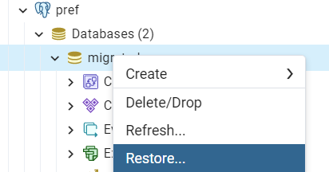
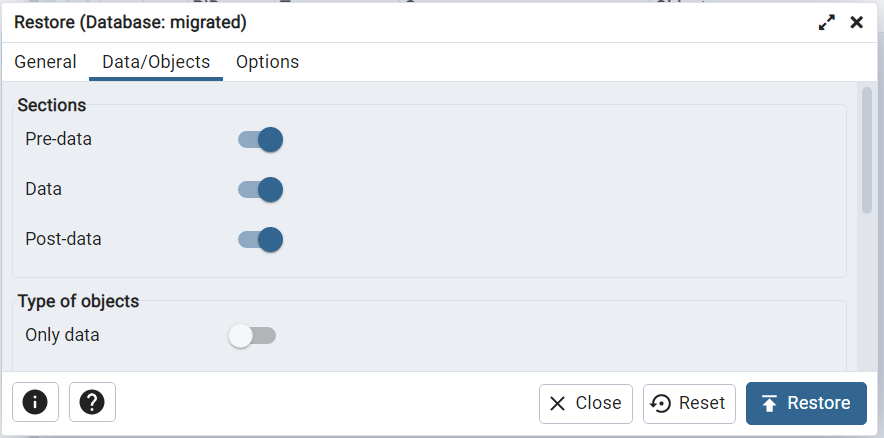
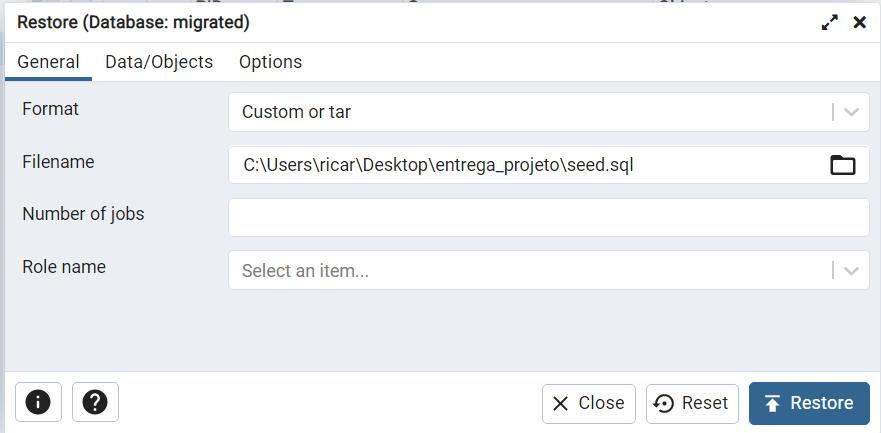

# PREF

### Requirements
- docker
- docker-compose
- make
- pgAdmin or other PostgreSQL client to seed the database via the `seed.sql` file

## Setup

Duplicate the `.env.example` file and rename it to `.env`.

Make sure to create the docker container:
```bash
# create container
make up
```

After the application is deployed the database needs to be seeded.
Use pgAdmin or other PostgreSQL client to seed the database using the `seed.sql` file.

#### Using pgAdmin:





Then run the following command to start the application:
```bash
# deploy application
make deploy
```
